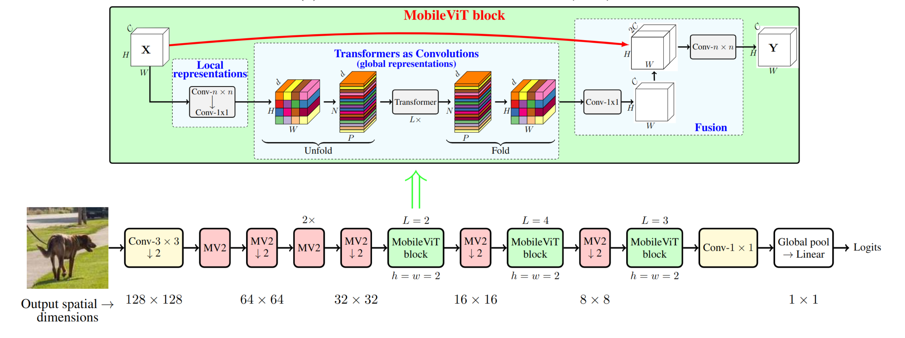
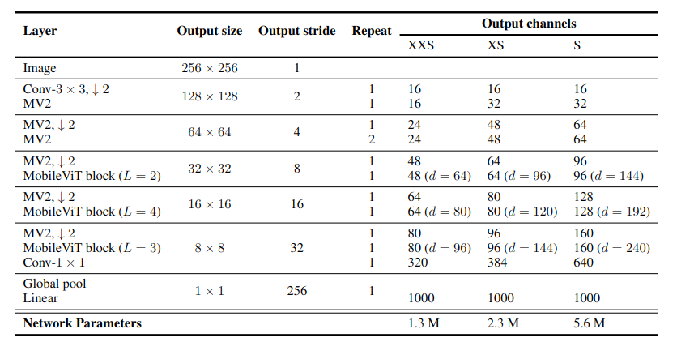
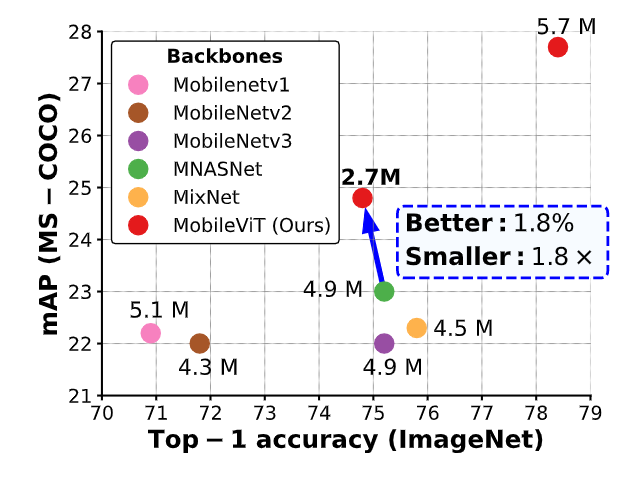
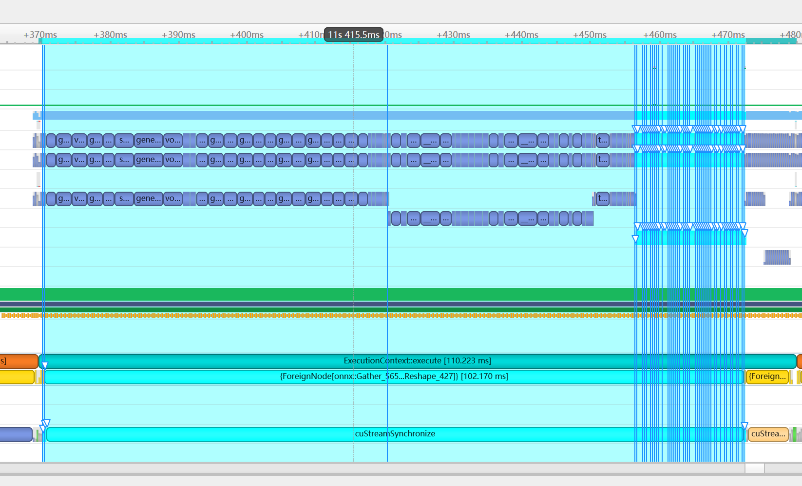
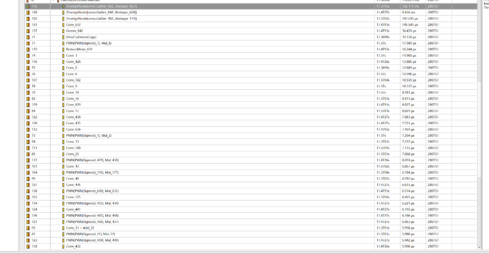
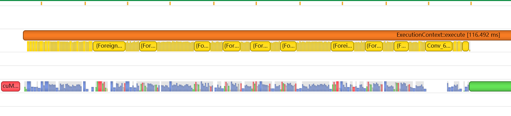
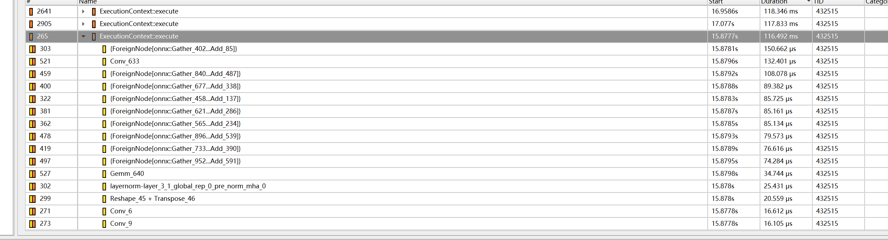
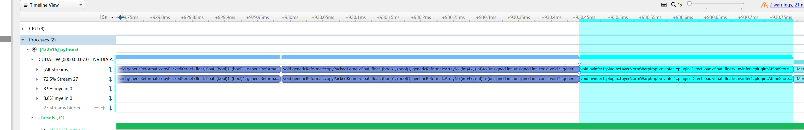

# TRT-Hackathon-2022-final
&lt;Good Luck To You!> 's work for &lt;TRT-Hackathon-2022-final>

---
## 一、总述
本次复赛我们选择使用TensorRT优化部署的模型是[MobileVit](https://arxiv.org/abs/2110.02178)，该项工作由Apple的研究者发表在ICLR2022上，项目开源在[地址](https://github.com/apple/ml-cvnets)。

---

## 二、原始模型
### 2.1 模型简介
MobileVit结合了CNN和ViT的优势构建了一个轻量级、低延时和移动设备友好的通用基础网络模型。轻量卷积神经网络(CNN)是移动视觉任务的实际应用。CNN的空间归纳偏差允许他们在不同的视觉任务中以较少的参数学习表征，然而CNN在空间上是却是局部的；为了学习全局表征，MobileVit引入了基于自注意力的**轻量化**的Vision Transformer(ViTs)模块，轻量化主要体现在使用了更小的注意力模块参数L与d。MobileVit能够作为检测、分割等视觉任务的基础网络应用于移动设备之中，均易于部署且能收获到不错的精度。\
模型的整体结构如下图所示,其中MV2代表MobileNetV2 block：
 \
MobileVit共有三种不同的网络规模(XXS，XS，S)，参数量逐渐升高，分别为1.3M，2.3M，5.6M，具体如下图所示:
 \
在MS-COCO数据集与ImageNet数据集上对比各个轻量化网络模型的测试结果如下图所示:

### 2.2 模型优化的难点
当前针对于MobileVit-S网络模型的优化难点总结如下：
1. 对于动态batch size的支持。Apple提供的pt与config文件无法直接生成动态batch size的TensorRT engine，需要手动调整源代码中的网络结构以及对算子图进行优化。
2. attention、layernorm等模块TensorRT plugin的实现，数据格式支持FP32、TF32以及FP16；使用Nsys分析实现结果，使用FasterTransformer实现MobileVit网络中的Transformer block插件。
3. int8以及int8相关TensorRT plugin的实现。轻量化模型在移动端使用int8数据格式能获得更好的加速效果。
4. 以MobileVit为基础网络的检测模型相应优化。
------------
## 三、优化过程
下面结合我们的优化流程介绍在过程中遇到的一些问题


### 3.1 ONNX模型导出
修改官网提供的代码导出onnx模型，这个步骤主要是参照官方提供的`main_eval.py`进行实现，通过将`multi_head_attention.py`与`mobilevit_block.py`中reshape操作的`-1`放在第一维度即可支持动态shape的输入。具体原则如下

1. 对于任何用到shape、size返回值的参数时，例如：tensor.view(tensor.size(0), -1)，B,C,H,W = x.shape 这类操作，避免直接使用tensor.size的返回值，而是加上int转换，tensor.view(int(tensor.size(0)), -1), B,C,H,W = map(int, x.shape)，断开跟踪。

2. 对于reshape、view操作时，-1的指定请放到batch维度。其他维度计算出来即可。batch维度禁止指定为大于-1的明确数字。如果是一维，那么直接指定为-1就好。


### 3.2 TensorRT 引擎生成
在`main_export.py`中添加生成engine的代码，此处遇到如下问题：
- 在设置网络精度为FP16的情况下，如何在不破坏tensorRT融合结果的情况下单独设置某层的精度为FP32? 

设置stict type并设置layer上的精度可以把它设置成fp16或fp32，可参考这个[例子](https://github.com/NVIDIA/trt-samples-for-hackathon-cn/blob/master/cookbook/09-Advance/StrictType/strictType.py)（设置成fp16）
- 使用polygraphy找到第一个精度不符合要求的层后，如何继续去寻找下一个精度不符合要求的层？直接切割子图进行分块输出还是使用对修改第一个不符合要求层后生成的engine进行继续调试，命令诸如
    ```shell
    polygraphy run decoder.plan 
      --model-type engine 
      --trt 
      --load-inputs=custom_decoder_inputs.json 
      --trt-outputs "788"
      --fp16  
      --save-results=_fp16.json
    ```
我们根据导师的建议所采用的方法是：在网络层数不是非常深的情况下，逐个单改Transformer网络层中的某一层从fp16到fp32，看精度提高幅度，取提高幅度最高的，作为改变的第一层；然后迭代这一过程，直到精度合格。


### 3.3 针对于mobileVit的性能热点分析及优化
使用Nsys对当前模型做性能分析（此时均是FP32结果），结果如下所示:





网络推理一次耗时在110.223ms以上，性能热点主要是Myelin所融合的3个Transformer block部分，分别耗时102.17ms/6.416ms/197.245us。

随后编写LayerNorm、attention插件替换ONNX图中节点，测试后发现速度变慢，使用Nsys进行分析。
以Layernorm结果为例子，如下所示：







网络推理一次耗时在116.492ms以上，并且从结果可以看出我们所替换的插件破坏了Myelin对于Transformer block部分的融合，多了许多小块的ForeignNode节点，表明此插件未能超越trt8.4所作的融合。后续我们还针对nsys的分析结果实现了fastertransformerplugin、swishplugin以及int8 PTQ等，具体过程请见`经验与体会`

### 3.4 SSD-MobileVit模型基于C++/CUDA的端到端部署实现
当前模型的的实现步骤主要分为以下两个过程：
#### 3.4.1 **导出模型**
- 官方提供的源码中并不支持动态shape的导出过程，需要在源代码中做出如下修改：

```python
# ml-cvnets/cvnets/models/detection/ssd.py 添加如下代码，output形状为[-1, 85]
    def export_onnx_forward(self, x: Tensor, *args, **kwargs):
        with torch.no_grad():
            confidences, locations, anchors = self.ssd_forward(x, is_prediction=True)
            scores = F.softmax(confidences, dim=-1)
            boxes = box_utils.convert_locations_to_boxes(
                pred_locations=locations,
                anchor_boxes=anchors,
                center_variance=getattr(self.opts, "model.detection.ssd.center_variance", 0.1),
                size_variance=getattr(self.opts, "model.detection.ssd.size_variance", 0.2)
            )

        return torch.cat([boxes, scores], dim=-1)

# ml-cvnets/cvnets/modules/ssd.py 代码作如下修改，主要是为了切断pytorchshape相关函数的跟踪,并仅将batch_size设置为变化维度
    def forward(self, x: Tensor):
        batch_size = int(x.shape[0])

        if self.proj_layer is not None:
            x = self.proj_layer(x)

        # [B x C x H x W] --> [B x Anchors * (coordinates + classes) x H x W]
        x = self.loc_cls_layer(x)

        # [B x Anchors * (coordinates + classes) x H x W] --> [B x H x W x Anchors * (coordinates + classes)]
        x = x.permute(0, 2, 3, 1)
        # [B x H x W x Anchors * (coordinates + classes)] --> [B x H*W*Anchors X (coordinates + classes)]
        mid_dim = int(x.numel() // (self.n_coordinates + self.n_classes) // batch_size)
        x = x.contiguous().view(-1, mid_dim, self.n_coordinates + self.n_classes)

        # [B x H*W*Anchors X (coordinates + classes)] --> [B x H*W*Anchors X coordinates], [B x H*W*Anchors X classes]
        box_locations, box_classes = torch.split(x, [self.n_coordinates, self.n_classes], dim=-1)
        return box_locations, box_classes
```


- 编写`main_export_dection.py`一键导出模型并生成trt engine。

#### 3.4.2 **端到端高效检测模型推理实现**
端到端的推理过程的实现，从数据的预处理和后处理都在GPU上完成。
- 前处理过程
将图片的前处理过程，包含resize、双线性插值与归一化写在一个cuda kernel中，避免多次数据传输与global memroy的访问，部分代码如下所示：

```cpp
// 双线性插值及resize过程
uint8_t const_value[] = {const_value_st, const_value_st, const_value_st};
float ly    = src_y - y_low;
float lx    = src_x - x_low;
float hy    = 1 - ly;
float hx    = 1 - lx;
float w1    = hy * hx, w2 = hy * lx, w3 = ly * hx, w4 = ly * lx;
float* pdst = dst + dy * dst_width + dx * 3;
uint8_t* v1 = const_value;
uint8_t* v2 = const_value;
uint8_t* v3 = const_value;
uint8_t* v4 = const_value;
if(y_low >= 0){
    if (x_low >= 0)
        v1 = src + y_low * src_line_size + x_low * 3;

    if (x_high < src_width)
        v2 = src + y_low * src_line_size + x_high * 3;
}

if(y_high < src_height){
    if (x_low >= 0)
        v3 = src + y_high * src_line_size + x_low * 3;

    if (x_high < src_width)
        v4 = src + y_high * src_line_size + x_high * 3;
}

c0 = w1 * v1[0] + w2 * v2[0] + w3 * v3[0] + w4 * v4[0];
c1 = w1 * v1[1] + w2 * v2[1] + w3 * v3[1] + w4 * v4[1];
c2 = w1 * v1[2] + w2 * v2[2] + w3 * v3[2] + w4 * v4[2];

// 归一化过程
c0 = (c0 * norm.alpha - norm.mean[0]) / norm.std[0];
c1 = (c1 * norm.alpha - norm.mean[1]) / norm.std[1];
c2 = (c2 * norm.alpha - norm.mean[2]) / norm.std[2];

```

- 推理过程
将输入、原始宽高、预处理后的输入及预测框坐标封装为一个结构体
```cpp
struct Job
{
    cv::Mat input;
    int ori_width;
    int ori_height;
    BoxArray output;
    shared_ptr<Tensor> mono_tensor;
};
```
随后将数据按照最大batch_size组织并传入反序列化后的trt engine进行推理。

- 后处理过程
后处理过程需要把预测框恢复到原图大小，在做NMS，这两个步骤可以使用cuda实现，核心部分如下：
```cpp
// 恢复预测框
for(int i = 0; i < num_classes; ++i, ++class_confidence){
    if(*class_confidence > confidence_threshold) {
        confidence = *class_confidence;  
        label = i;

        int index = atomicAdd(parray, 1);
        if(index >= max_objects)
            return;

        float* pout_item = parray + 1 + index * NUM_BOX_ELEMENT;
        *pout_item++ = left;
        *pout_item++ = top;
        *pout_item++ = right;
        *pout_item++ = bottom;
        *pout_item++ = confidence;
        *pout_item++ = label;
        *pout_item++ = 1;
    }
}
// nms
float* pcurrent = bboxes + 1 + position * NUM_BOX_ELEMENT;
for(int i = 0; i < count; ++i){
    float* pitem = bboxes + 1 + i * NUM_BOX_ELEMENT;
    if(i == position || pcurrent[5] != pitem[5]) continue;

    if(pitem[4] >= pcurrent[4]){
        if(pitem[4] == pcurrent[4] && i < position)
            continue;

        float iou = box_iou(
            pcurrent[0], pcurrent[1], pcurrent[2], pcurrent[3],
            pitem[0],    pitem[1],    pitem[2],    pitem[3]
        );

        if(iou > threshold){
            pcurrent[6] = 0;  // 1=keep, 0=ignore
            return;
        }
    }
}
```

-----------

## 四、精度与加速效果

当前测试环境为A10+Trt8.4。

MobileVit使用**imagenet**数据集进行精度测试，使用模拟数据测试速度，使用batch_size=128：

|implement|top1-Acc|latancy(ms)|
|-|-|-|
|pytorch-GPU|78.4|155.54|
|trt-FP32|78.28|114.52|
|trt-FP16|78.26|41.79|

SSD-MobileVit使用**coco**数据集进行测试，batch_size=32，每一帧处理时间包含前处理与后处理：

|implement|mAP|FPS|
|-|-|-|
|pytorch|27.7|42.81|
|trt-FP32|26.4|281.95|
|trt-FP16|26.4|362.17|

> 注：分类与检测使用的测试脚本见`src/classification/autobuild.sh`与`src/detection/autobuild.sh`；模拟数据使用`src/ml-cvnets/gen-npz.py`生成

-----------
## 五、经验与体会
根据nsys分析结果尝试编写一些插件替换性能不足的算子，主要包括几个plugin的编写与int8 PTQ的尝试，plugin部分代码在`trt_plugin`文件夹中，int8量化部分具体代码位于`src/Classification/int8_process.py`，但并均没有能够击败tensorRT8.4的算子融合策略。
### 5.1 **fastertransformer plugin 编写**
通过上一部分分析发现TensorRT8.4已经对模型中Transformer block部分进行了比较高效的融合，如果想超过该结果需要进行更深层次的优化，所以决定开始编写基于FasterTransformer的插件，在编写插件过程中遇到了如下问题

#### 5.1.1 **变量生命周期问题**

TensorRT C++ api中`PluginField`的定义如下

```c++

class PluginField
{
public:
    AsciiChar const* name;
    void const* data;
    PluginFieldType type;
    int32_t length;
 
    PluginField(AsciiChar const* const name_ = nullptr, void const* const data_ = nullptr,
        PluginFieldType const type_ = PluginFieldType::kUNKNOWN, int32_t const length_ = 0) noexcept
        : name(name_)
        , data(data_)
        , type(type_)
        , length(length_)
    {
    }
};

```

通过上面我们可以看到，`PluginField`中的指针变量采用的是浅拷贝的方式，因此如果想正常使用就需要保证指针指向的变量的生命周期大于等于使用周期。


如下面代码，如果将`data_npz`定义为循环里面的局部变量，那么循环结束后`data_npz`占用内存就会被释放，从而导致`fieldCollections`中新增的`PluginField`的指针指向一块未被申请的内存，导致结果不正确。

```c++

std::vector<PluginField> fieldCollections;
std::string npz_name("npz_path");

cnpy::npz_t data_npz;

int npz_path_len = 0;
std::string npz_path_len_name("npz_path_len");
for(int i = 0; i < fc->nbFields; i++) {
    if(npz_path_len_name.compare(fc->fields[i].name) == 0) {
        npz_path_len = *((const int*)fc->fields[i].data);
    }
}

for(int i = 0; i < fc->nbFields; i++) {
    if(npz_name.compare(fc->fields[i].name) == 0) {
        string npz_path((const char*)fc->fields[i].data, npz_path_len);

        // cnpy::npz_t data_npz = cnpy::npz_load(npz_path);
        data_npz = cnpy::npz_load(npz_path);
        for(auto& iter: data_npz) {
            auto& item = iter.second;
            if(0 == type_id) {
                fieldCollections.emplace_back(PluginField(iter.first.c_str(), item.data<float>(), PluginFieldType::kFLOAT32, item.num_vals));
            } else if(1 == type_id) {
                fieldCollections.emplace_back(PluginField(iter.first.c_str(), item.data<half>(), PluginFieldType::kFLOAT16, item.num_vals));
            }
        }
    } else {
        fieldCollections.emplace_back(fc->fields[i]);
    }
}

```

#### 5.1.2 **变长属性的处理** 

`PluginField`在解析时候是需要指定长度的，但是对于一些可变长度数据来说这个事先是无法确定的。比如onnx中的字符串属性，在传入到TensorRT时，有没有`'\0'`结尾是不能保证的，因此需要设置一个属性来记录字符串的长度，这也就是上面`npz_path_len`的用处，对于其他比如float数组也是相同处理方式。

在mobilevit插件编写中，transformer的权重传入有三种方式

1. 当作输入传进去
2. 作为属性传入，由于属性的数量会随着encoder的层数变化，所以这里需要采用最大属性数量。此外还需要每个传入的数组数据额外添加一个长度属性。
3. 把权重npz路径当作属性传入，插件里解析npz来填充权重值

综合考虑源码的改动程度，我们采用第三种方案。


#### 5.1.3 **plugin编译release和debug的问题**

在debug模式下，plugin可以编译成功，但是在构建`engine`的时候会报`LLVM: out of memory`的错误。

在release模式下，plugin可以正常编译且正常构建`engine`。

编写好插件并进行测试后，使用Nsys进行性能分析，发现如下问题：

<!-- #### 3.4.3 **多流问题**
使用ft 插件后，cublas使用默认流而网络中其他层使用自己创建的流，两个不在同一个流程，可能会导致数值错误，该问题目前未得到解决 -->

### 5.2 **int8 PTQ支持**
主要编写了`ImageNetEntropyCalibrator`,使用imagenet的validation数据进行校准。

### 5.3 **swish插件编写**
在使用了nsys分析fp16 baseline的结果时，发现conv算子(计算密集型)与trt合并的swish算子(访存密集型)所花费的时间差不多，说明trt融合后的swish算子可能出现了memory bound，所以具有一定的优化空间。当前一共实现了两个版本的swish plugin，分别是基于oneflow-elementwise模板与cudnn API的，均能够在trt8.4中运行。

### 5.4 **插件测试结果**
测试环境是Nvidia A10 + trt8.4，使用模拟数据对不同插件的测试结果见`result_record`文件夹


<!-- 1. 负优化的心路历程 nsys-ui
2. mobileVit layer 继承自BaseLayer，仿照Vit
3. plugin 需要进行修改，确定输入输出格式，以及对plugin的测试  先达到FP16 -->


<!-- 待解决问题:
1. cublas不同流的问题，可能会导致数据错误
2. 使用int8
3. 添加检测 -->

<!-- 当前获得一个信息：trt8.4已经能够编写性能很强的transformer plugin了，在wenet上能够获得比较好的性能提升 -->

### 主要参考项目 ###
1. [ml-cvnets](https://github.com/apple/ml-cvnets)
2. [FasterTransformer](https://github.com/NVIDIA/FasterTransformer)
3. [tensorRT-Pro](https://github.com/shouxieai/tensorRT_Pro)
